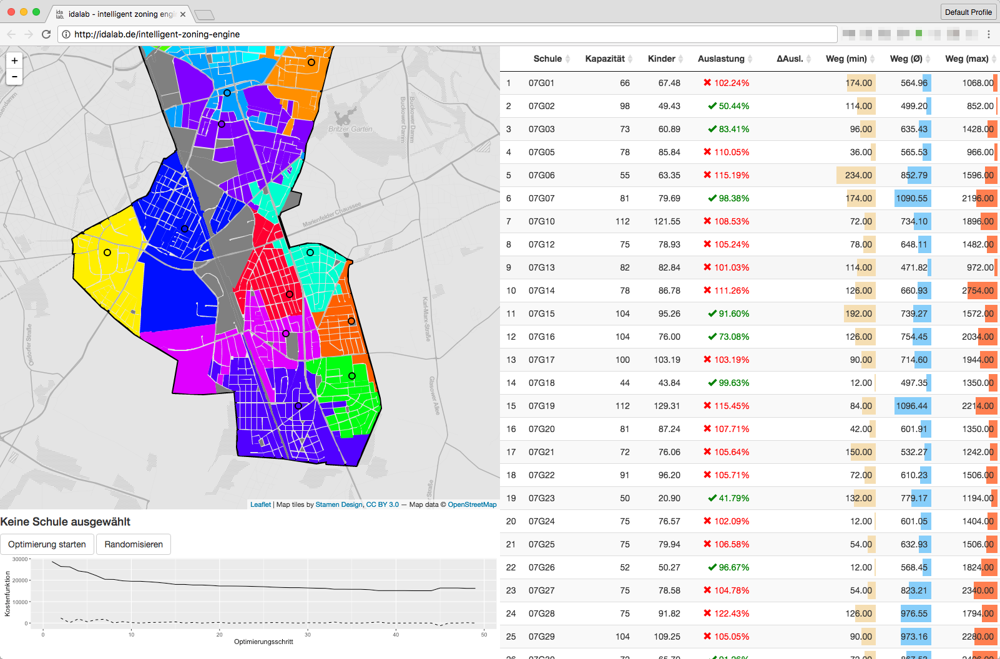

# Intelligent Zoing Engine

IZE is a tool for cutting catchment areas. We are using it for primary schools in Berlin.

## Setup

    cp dotenv.example .env
    brew install R

Also install https://www.docker.com/

Folder structure is as follows:
- data — contains _immutable_ data
- download – contains downloaded datasets (disposable - recreate with `make download`)
- output – contains generated datasets (disposable - see `Makefile`)
- app – contains the shiny app
- R – contains R files containing functions
- figs – contains generated graphics/reports (disposable)
- . – contains Notebooks and R Scripts that do stuff (many of them will be run by `make` targets)

### OSRM

	cd osrm
	docker-compose up

We are using this pull request: https://github.com/Project-OSRM/osrm-backend/pull/2764

	curl "http://localhost:5000/table/v1/foot/13.388860,52.517037;13.397634,52.529407;13.428555,52.523219?sources=0&output_components=distances;durations"
	
And in R

    devtools::install_github("kirel/osrm", ref = "table-distances")

## Scraper

Don't run this. Data is in `data`.

## Download data

    make download

## Preprocessing

Alle Daten herunterladen und vorverarbeiten via

    make process

Some of the tasks need OSRM running

## Run app

    docker-compose up
    open http://localhost:3535

or

    sh start.sh
    open http://localhost:3535

## Datenkatalog

See `DATA.md`
